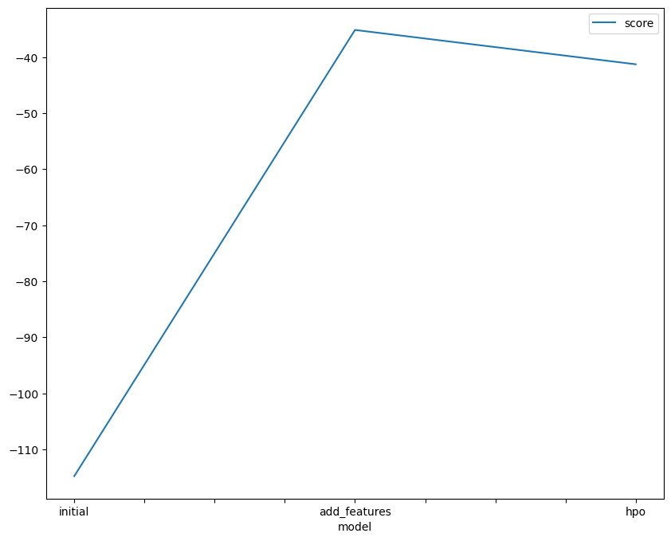

# Report: Predict Bike Sharing Demand with AutoGluon Solution
#### SOPHY JEPTOO

## Initial Training
### What did you realize when you tried to submit your predictions? What changes were needed to the output of the predictor to submit your results?
TODO: A Pandas Series object is the predictor's output. We build a series object called predictions and record the forecasts' result in a submission dataframe, which is then saved as a.csv file for submission. This allows us to send the predictions in the necessary datetime and count format.
### What was the top ranked model that performed?
TODO: My best score was 0.62685

## Exploratory data analysis and feature creation
### What did the exploratory analysis find and how did you add additional features?
TODO: The dataset's distributions for each data feature were displayed through exploratory analysis. Season and weather are examples of features that were encoded as categorical in order to improve the accuracy of the findings. There are separate hour, day, and month characteristics in the datetime column. The distribution of days and hours is right-skewed, whereas that of holidays is extremely imbalanced. Count's distribution is normal.

### How much better did your model preform after adding additional features and why do you think that is?
TODO: The datetime field's division into the year, month, day, and hour, together with the model's output, was, in my opinion, the best improvement.

## Hyper parameter tuning
### How much better did your model preform after trying different hyper parameters?
TODO: The model's performance was little poorer than the improvement with only the features, but it was still substantially better than the original model. I tried using autogluon's recommended hyperparameter enhancement for tabular data, but I was unable to figure out how to further adjust the parameters to get a better outcome. Additional contextual data is required to optimize the model.

### If you were given more time with this dataset, where do you think you would spend more time?
TODO: Since the features appear to be the ones that raise the score, I would strive to come up with more ways to make them better. Perhaps we can get a better outcome by doing some one-hot encoding or making adjustments for the seasons or working hours.

### Create a table with the models you ran, the hyperparameters modified, and the kaggle score.
|model|hpo1|hpo2|hpo3|score|
|--|--|--|--|--|
|initial|?|?|?|?|
|add_features|?|?|?|?|
|hpo|?|?|?|?|

model	hpo1	hpo2	hpo3	score
0	initial_model	default_vals	default_vals	default_vals	1.80114
1	add_features_model	default_vals	default_vals	default_vals	0.62685
2	hpo_model	GBM: num_leaves: lower=26, upper=66	NN: dropout_prob: 0.0, 0.5	GBM: num_boost_round: 100	0.49818

### Create a line plot showing the top model score for the three (or more) training runs during the project.

TODO: Replace the image below with your own.

### Create a line plot showing the top kaggle score for the three (or more) prediction submissions during the project.

TODO: Replace the image below with your own.

## Summary
TODO: Working with the features yields the greatest benefits, and the EDA can provide insightful information. In the future, I would like to refine the model by accounting for how working hours affect bike demand as well as seasonal highs and lows.

